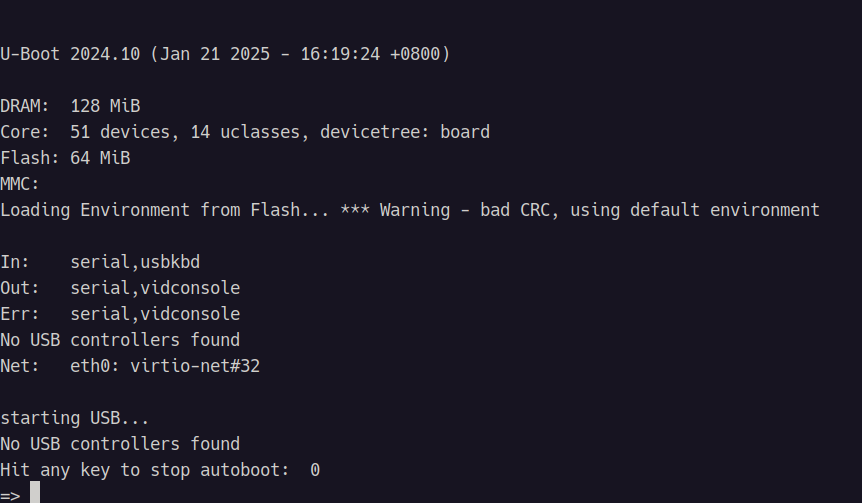
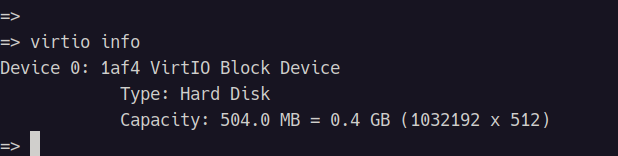
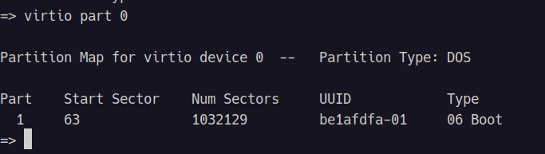
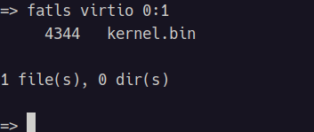

[toc]

# 在 qemu 中使用 u-boot 加载并运行可执行文件
## 简介
此次测试是在 qemu (系统仿真)中尝试使用 u-boot 加载并运行 原始的可执行二进制文件(.bin)，由于想了解了解这个过程的底层逻辑，所有需要做如下工作：
* 编写一个非常简单的汇编代码，编译生成 .bin 文件：
    * 编写汇编代码，编译生成目标代码(.S -> .o)
    * 自定义 ld 链接脚本，指导链接过程(.o -> .elf)
    * 由elf 文件生成 原始二进制文件(.elf -> .bin)
* qemu 进行系统仿真，并将 .bin 文件以虚拟磁盘的方式加载，供 u-boot 使用:
    * 启动 qemu 系统仿真，进入 u-boot
    * u-boot 加载 .bin 文件到内存
    * run .bin 文件
## 生成 .bin 二进制可执行文件
### 汇编程序代码
start.S 汇编文件：  
```S
	.text
	.global start

start:
	b start
```
### ld 链接脚本
kernel.lds 链接脚本：  
```lds
OUTPUT_FORMAT(elf64-aarch64)
ENTRY(start)

	PHDRS
{
	headers PT_PHDR PHDRS;
	text PT_LOAD FILEHDR PHDRS;
	rodata PT_LOAD;
	data PT_LOAD;
	dynamic PT_DYNAMIC;
}

SECTIONS
{
	. = SIZEOF_HEADERS;
	. = 0x1000;
	_IMAGE_START = .;

	.text : {
		_TEXT_BEGIN = .;
		*(.text)
			_TEXT_END = .;
	} :text

	.init_array : ALIGN(0x1000) {
		_INIT_BEGIN = .;
		KEEP(*(SORT(.init_array.*)))
			KEEP(*(.init_array))
			_INIT_END = .;
	} :rodata

	.rodata : {
		_RODATA_BEGIN = .;
		*(.rodata)
			_RODATA_END = .;
	} :rodata

	.data.rel.ro : {
		_RELRO_BEGIN = .;
		*(.data.rel.ro)
			_RELRO_END = .;
	} :rodata

	.rela.dyn : {
		_RELA_BEGIN = .;
		*(.rela.dyn)
			_RELA_END = .;
	} :rodata

	.dynamic : {
		_DYNAMIC = .;
		*(.dynamic)
	} :rodata :dynamic

	.data : {
		_DATA_BEGIN = .;
		*(.data)
			_DATA_END = .;
	} :data

	.bss : {
		_BSS_BEGIN = .;
		*(.bss)
			_BSS_END = .;
	} :data
}
```
### 生成原始二进制文件(.bin)
* start.S -> start.o
```shell
clang -fPIE -target aarch64-unknown-none -c start.S -o start.o
```
* start.o -> kernel.elf
```shell
lld -flavor ld -maarch64elf --pie --static --nostdlib --script=./kernel.lds ./start.o -o kernel.elf
```
* kernel.elf -> kernel.bin
```shell
llvm-objcopy-18 -O binary kernel.elf kernel.bin
```
## qemu 启动 u-boot
### qemu系统仿真
```shell
qemu-system-aarch64 \
	-machine virt,virtualization=on,secure=off \
	-cpu max \
	-bios ~/source/u-boot-2024.10/u-boot.bin \
	-nographic \
	-drive file=fat:rw:./rootfs,format=raw,media=disk
```
其中 qemu 的 `-bios` 指定 u-boot, -drive` 选项可以将指定的目录看作一个虚拟磁盘。  
运行结果：  


### u-boot 加载并运行可执行程序
#### 查看虚拟磁盘信息
* 查看可用的虚拟磁盘
```shell
virtio info
```
运行结果：  

* 查看磁盘分区的内容
```shell
virtio part 0
```
运行结果：  

* 查看磁盘中的文件
```shell
fatls virtio 0:1
```
运行结果：  

#### 查看内存信息
```shell
bdinfo
```
#### 加载 .bin 
* 加载 .bin
```shell
fatload virtio 0:1 0x40000000 kernel.bin
```
* 运行
```shell
go 0x40000000
```
## I think
前两天就在想着如何入手 qemu 系统仿真，亲自体验一下从 u-boot 启动到可执行程序加载，再到运行的全流程，偶然间看到了 [Mike][Mike] 的帖子 [getting started with u-boot][post_url]，确实挺不错的，就试了试，虽说没太深究细节，但是亲自体验一遍后收获还是挺大的

以后有机会再来深入学习学习。


[Mike]: https://krinkinmu.github.io/
[post_url]: https://krinkinmu.github.io/2023/08/12/getting-started-with-u-boot.html
